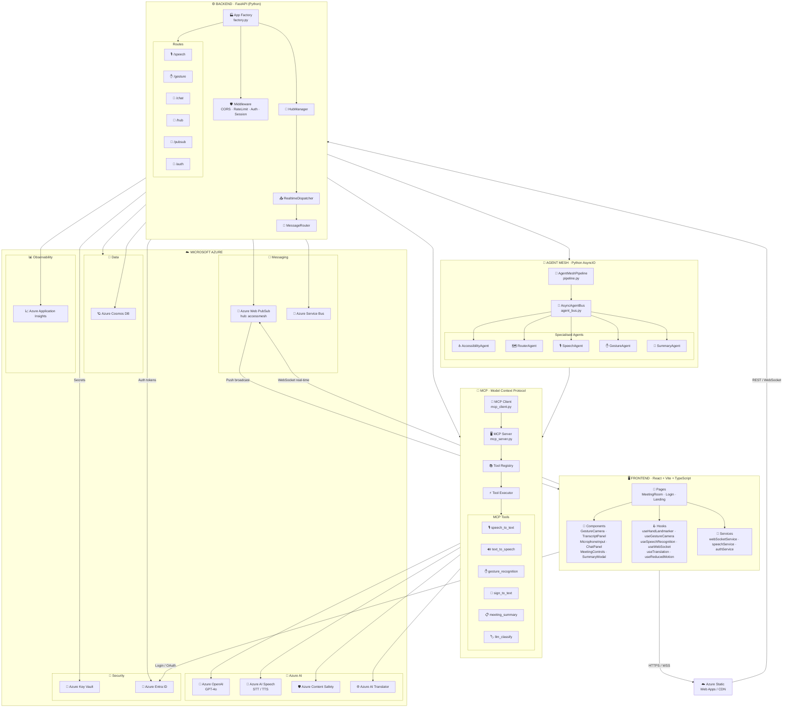

<div align="center">

# ♿ AccessMesh-AI

### *Every voice heard. Every gesture understood. Every meeting inclusive.*

[](https://python.org)
[](https://fastapi.tiangolo.com)
[](https://react.dev)
[](https://www.typescriptlang.org)
[](https://azure.microsoft.com)
[](LICENSE)

</div>

---

## 📋 Table of Contents

- [Overview](#-overview)
- [Key Project Highlights](#-key-project-highlights)
- [Features](#-features)
- [Architecture](#-architecture)
  - [Cloud Architecture](#️-cloud-architecture--azure-services-map)
  - [Agent Mesh Flow](#-agent-mesh--internal-flow)
  - [Message Flow](#message-flow)
- [MCP — Model Context Protocol](#-mcp--model-context-protocol)
- [Frontend — React 19](#️-frontend--react-19)
- [Backend — Python / FastAPI](#-backend--python--fastapi)
- [Technology Stack](#️-technology-stack)
- [Quick Start](#-quick-start)
- [Installation](#-installation)
- [Docker](#-docker)
- [Infrastructure & Deployment](#-infrastructure--deployment)
- [Environment Variables Reference](#-environment-variables-reference)
- [Testing](#-testing)
- [Security](#-security)
- [Project Structure](#️-project-structure)
- [Roadmap & Future Evolution](#-roadmap--future-evolution)
- [Contributing](#-contributing)
- [License](#-license)

---

## 🎯 Overview

**AccessMesh-AI** is an AI-driven accessible meeting platform that eliminates communication barriers between deaf, hard-of-hearing, and hearing participants — in real time. By combining real-time speech recognition, camera-based sign-language capture via MediaPipe, AI-powered gesture interpretation, and instant TTS synthesis, the system delivers a truly inclusive and omni-channel communication experience.

> **"Any communication modality — everyone in the same meeting."**

The platform is built on three pillars:

- **Modality-agnostic input** — voice, text, and sign language are first-class citizens.
- **AI-first processing** — every message flows through an intelligent agent mesh powered by GPT-4o.
- **Cloud-native resilience** — all components run gracefully in degraded mode when optional services are unavailable.

---

## 🌟 Key Project Highlights

These are the architectural and technical decisions that differentiate AccessMesh-AI:

### 1. Gesture Recognition Pipeline with Smart Debounce
Sign-language capture runs fully **client-side** using MediaPipe Hand Landmarker. No video frames are sent to the server — only anonymised landmark vectors. A four-layer filtering pipeline prevents spurious detections:
- **Motion guard** — suppresses recognition while the hand is in transit between signs
- **Frame stability counter** — requires 10 consecutive matching frames (~333 ms @ 30 fps)
- **Hold timer** — the sign must be held stable for 800 ms
- **Emission cooldown** — same label cannot fire again within 1.5 s

### 2. Agent Mesh Architecture
The backend is not a monolith. It is a set of **fully decoupled, async agents** communicating via `AsyncAgentBus` (in-process pub/sub) and Azure Service Bus (cross-instance). Each agent is independently replaceable without touching the others.

### 3. MCP — Model Context Protocol
All AI capability consumption is isolated behind a **structured MCP server**. Agents never import Azure SDKs directly — they call tools via HTTP. This makes every AI capability independently versioned, testable, and replaceable.

### 4. Zero-Secret Production Runtime
In production, **no credentials are stored in environment variables or config files**. The application uses Azure Managed Identity to authenticate to Key Vault and pull all secrets at startup. Local development uses `.env` via a `KeyVaultSettingsSource` priority chain.

### 5. Graceful Degraded Mode
Every Azure service wrapper implements a **soft-init pattern**: if credentials are missing or a service is unavailable at startup, the system logs a warning and continues. This prevents cascading startup failures during development and canary deployments.

### 6. Privacy-First Gesture Processing
The `GestureCamera` component processes all landmark data locally in the browser. A `🔒 Processado localmente` indicator is always visible to the user. Only the minimal gesture classification result (label + confidence) is transmitted — never raw video.

---

## ✨ Features

| Category | Feature |
|----------|---------|
| 🎤 **Voice → Text** | Real-time transcription via Azure AI Speech (STT) with multi-language support |
| 🤟 **Gesture → Text** | Client-side sign capture and classification with MediaPipe Hand Landmarker (no video sent to server) |
| 🗣️ **Text → Audio** | TTS speech synthesis for accessible messages via Azure AI Speech |
| 🤟 **Sign Adaptation** | Converts spoken text to LIBRAS/ASL grammatical structure (gloss) via GPT-4o |
| 🧠 **Smart Routing** | Intent classification routes messages to the correct agent via GPT-4o |
| 📋 **Meeting Summary** | Automatic generation of structured summaries with key points via GPT-4o |
| 🛡️ **Content Moderation** | Message safety analysis via Azure Content Safety |
| 📡 **Real-Time Broadcast** | Instant message delivery to all participants via Azure Web PubSub |
| 🔐 **JWT Authentication** | Secure login with access token + refresh token (bcrypt + jose) |
| 📊 **Telemetry** | Full observability via Azure Application Insights + OpenTelemetry |
| 🗄️ **Persistence** | Sessions and messages stored in Azure Cosmos DB (serverless) |
| ☁️ **Secure Secrets** | Credentials managed via Azure Key Vault (Managed Identity — no secrets in env on production) |
| 🌐 **Translation** | Multi-language caption support via Azure AI Translator |
| 🏗️ **IaC** | Full Bicep infrastructure-as-code for one-command provisioning |

---

## 🏗️ Architecture

### ☁️ Cloud Architecture — Azure Services Map



#### Azure Services at a Glance

| Service | Role |
|---|---|
| 🤖 **Azure OpenAI (GPT-4o)** | LLM for routing, sign-language gloss, summarisation, classification |
| 🎤 **Azure AI Speech** | Real-time STT and natural TTS (multilingual) |
| 🛡️ **Azure Content Safety** | Automatic content moderation on all messages |
| 🪐 **Azure Cosmos DB** | NoSQL persistence — sessions, messages, meetings (serverless) |
| 📡 **Azure Web PubSub** | Real-time WebSocket broadcast to all meeting participants |
| 🚌 **Azure Service Bus** | Async distributed messaging across Agent Mesh instances |
| 🔑 **Azure Key Vault** | Secure storage for all secrets and credentials (Managed Identity) |
| 👤 **Azure Entra ID** | OAuth 2.0 / JWT authentication |
| 📈 **Azure Application Insights** | Distributed traces, metrics and telemetry (OpenTelemetry) |
| 🌐 **Azure AI Translator** | Multi-language caption translation |
| 🐳 **Azure Container Apps** | Serverless, auto-scaling container hosting for the backend |
| 🖥️ **Azure Static Web Apps** | Global CDN hosting for the React frontend |
| 📦 **Azure Container Registry** | Private Docker image registry |

---

### 🤖 Agent Mesh — Internal Flow

AccessMesh-AI is built on the **Agent Mesh** pattern: a set of specialised, decoupled agents that communicate through an async pub/sub bus (`AsyncAgentBus`). Each agent subscribes to specific message types, processes them independently, and publishes results back onto the bus — with no direct coupling between agents.

```
┌─────────────────────────────────────────────────────────────────────────┐
│                         FRONTEND  (React 19 / Vite)                     │
│  MicrophoneInput  │  GestureCamera  │  TranscriptPanel  │  ChatPanel    │
└─────────────────────────┬───────────────────────────────────────────────┘
                          │  REST / WebSocket / WebPubSub
┌─────────────────────────▼───────────────────────────────────────────────┐
│                       BACKEND  (FastAPI)                                │
│  /hub  /auth  /speech  /gesture  /pubsub  /chat                         │
│  HubManager · RealtimeDispatcher · MessageRouter                        │
└─────────────────────────┬───────────────────────────────────────────────┘
                          │  AsyncAgentBus  (+ Azure Service Bus)
┌─────────────────────────▼──────────────────────────────────────────────┐
│                       AGENT MESH                                        │
│                                                                         │
│   AUDIO_CHUNK ──► SpeechAgent ──► TRANSCRIPTION                         │
│   GESTURE     ──► GestureAgent ──► TRANSCRIPTION                        │
│                                         │                               │
│                                    RouterAgent                          │
│                               (GPT-4o classification)                   │
│                                    ROUTED                               │
│                                       │                                 │
│                              AccessibilityAgent                         │
│                            (TTS synthesis + subtitles                   │
│                              + accessibility features)                  │
│                                  ACCESSIBLE                             │
│                                       │                                 │
│                                  SummaryAgent                           │
│                          (SUMMARY_REQUEST → Cosmos DB                   │
│                           → GPT-4o → SUMMARY broadcast)                 │
│                                    SUMMARY                              │
└─────────────────────────┬──────────────────────────────────────────────┘
                          │
┌─────────────────────────▼───────────────────────────────────────────────┐
│                  MCP SERVER  (Model Context Protocol)                   │
│  speech_to_text │ text_to_speech │ sign_to_text │ gesture_recognition   │
│  meeting_summary │ llm_classify                                         │
└─────────────────────────┬───────────────────────────────────────────────┘
                          │
┌─────────────────────────▼───────────────────────────────────────────────┐
│                      AZURE SERVICES                                     │
│  Speech │ OpenAI (GPT-4o) │ Cosmos DB │ Web PubSub │ Service Bus        │
│  Content Safety │ Key Vault │ App Insights │ Entra ID │ Translator       │
└─────────────────────────────────────────────────────────────────────────┘
```

### Message Flow

| Step | Message Type | Responsible Agent | Action |
|------|-------------|------------------|--------|
| 1 | `AUDIO_CHUNK` | `SpeechAgent` | Transcribes audio via Azure AI Speech |
| 2 | `GESTURE` | `GestureAgent` | Converts stable sign label to natural text |
| 3 | `TRANSCRIPTION` | `RouterAgent` | Classifies intent via GPT-4o |
| 4 | `ROUTED` | `AccessibilityAgent` | TTS synthesis + subtitle enrichment |
| 5 | `ACCESSIBLE` | `SummaryAgent` | On `SUMMARY_REQUEST` → GPT-4o summary → Cosmos DB + WebPubSub broadcast |

---

## 🔌 MCP — Model Context Protocol

The **MCP Server** is a capabilities layer exposed via FastAPI that fully decouples agents from Azure services. Agents call tools through `MCPClient` — they never import Azure SDKs directly. This guarantees replaceability, testability, and independent evolution of each capability.

```
Agents  ──►  MCPClient  ──►  HTTP POST /tools/call  ──►  MCP Server
                                                               │
                                                          ToolRegistry
                                                               │
                              ┌────────────────────────────────┤
                              ▼                                ▼
                     speech_to_text_tool            sign_to_text_tool
                     (Azure Speech SDK)             (GPT-4o gloss gen)
                              ▼                                ▼
                     text_to_speech_tool           llm_classify_tool
                     (Azure Speech TTS)            (GPT-4o routing)
                              ▼                                ▼
                   meeting_summary_tool       gesture_recognition_tool
                   (GPT-4o summarization)     (Azure OpenAI Vision)
```

### Registered MCP Tools

| Tool | Description |
|------|-------------|
| `speech_to_text_tool` | Transcribes base64 audio (WebM/Opus, WAV) via Azure Speech SDK |
| `text_to_speech_tool` | Multi-language speech synthesis via Azure Neural TTS |
| `sign_to_text_tool` | Adapts spoken text to LIBRAS/ASL grammatical structure (gloss) via GPT-4o |
| `gesture_recognition_tool` | Gesture classification from hand landmarks via Azure OpenAI Vision |
| `meeting_summary_tool` | Structured transcript summarisation via GPT-4o |
| `llm_classify_tool` | Intent classification for intelligent routing via GPT-4o |

MCP server endpoints:

```
GET  /health         → liveness probe
GET  /tools/list     → lists all tools with their JSON Schema input descriptions
POST /tools/call     → invokes a tool by name with validated parameters
```

> Authentication via `X-MCP-API-Key` header (optional in dev mode, required in production).

---

## ⚛️ Frontend — React 19

A single-page application built with **React 19 + TypeScript + Vite 8**, focused on accessibility and inclusive UX.

### Pages

| Route | Page | Description |
|-------|------|-------------|
| `/login` | `LoginPage` | Email/password authentication |
| `/register` | `RegisterPage` | Sign-up with preferred communication mode |
| `/` | `Home` | Meeting room dashboard |
| `/meeting/:roomId` | `MeetingRoom` | Full accessible meeting room |

### Core Components

| Component | Role |
|-----------|------|
| `MicrophoneInput` | Audio capture and submission for transcription |
| `GestureCamera` | Client-side sign capture with MediaPipe + 4-layer gesture debounce |
| `TranscriptPanel` | Live transcript display panel |
| `ChatPanel` | Message panel with subtitle and accessibility mode support |
| `MeetingControls` | Meeting controls (mute, camera, end call) |
| `SummaryModal` | Displays the AI-generated summary at the end of a meeting |
| `ErrorBoundary` | React error boundary with accessible fallback UI |

### Gesture Detection Thresholds

| Constant | Value | Purpose |
|----------|-------|---------|
| `MOTION_THRESHOLD` | `0.02` | Max landmark delta per frame (2% of frame) before motion is detected |
| `DEBOUNCE_FRAMES` | `10` | Minimum consecutive matching frames (~333 ms @ 30 fps) |
| `HOLD_MS` | `800` | Minimum stable hold time before emitting |
| `DEBOUNCE_MS` | `1500` | Cooldown between identical gesture emissions |
| `CONFIDENCE_THRESHOLD` | `0.65` | Minimum local classifier confidence |

### Key Dependencies

```json
{
  "@mediapipe/tasks-vision": "^0.10.14",
  "framer-motion": "^12.36.0",
  "react-router-dom": "^7.13.1",
  "lucide-react": "^0.577.0"
}
```

---

## 🐍 Backend — Python / FastAPI

REST and WebSocket API built with **FastAPI** and **Uvicorn**, with lifecycle managed by `asynccontextmanager`.

### Route Structure

| Prefix | File | Purpose |
|--------|------|---------|
| `/auth` | `auth_routes.py` | Registration, login, token refresh, user preferences |
| `/hub` | `hub_routes.py` | Unified omni-channel endpoint (speech / gesture / text) |
| `/speech` | `speech_routes.py` | Audio upload and transcription response |
| `/gesture` | `gesture_routes.py` | Frame / landmark gesture classification |
| `/pubsub` | `pubsub_routes.py` | Azure Web PubSub integration |
| `/chat` | `chat_routes.py` | Chat messages and session history |

### Azure Service Wrappers

| Service | Class | Primary Env Variables |
|---------|-------|----------------------|
| Azure Speech | `SpeechService` | `AZURE_SPEECH_KEY`, `AZURE_SPEECH_REGION` |
| Azure OpenAI | `OpenAIService` | `OPENAI_KEY`, `OPENAI_ENDPOINT`, `OPENAI_DEPLOYMENT` |
| Azure Cosmos DB | `CosmosService` | `COSMOS_ENDPOINT`, `COSMOS_KEY` |
| Azure Web PubSub | `WebPubSubService` | `WEBPUBSUB_CONNECTION_STRING` |
| Azure Service Bus | `ServiceBusService` | `SERVICEBUS_CONNECTION_STRING` |
| Azure Content Safety | `ContentSafetyService` | `CONTENT_SAFETY_ENDPOINT`, `CONTENT_SAFETY_KEY` |
| Azure Key Vault | `KeyVaultService` | `AZURE_KEYVAULT_URL` |
| Azure App Insights | `TelemetryService` | `APPINSIGHTS_CONNECTION_STRING` |
| Azure Gesture (OpenAI) | `GestureService` | `GESTURE_API_KEY`, `GESTURE_API_ENDPOINT` |
| Summarization | `SummarizationService` | `OPENAI_KEY`, `OPENAI_ENDPOINT` |

> All services operate in **graceful degraded mode**: when credentials are not configured, the system continues running with an in-memory fallback or stub — startup never fails due to missing optional services.

### Security Layers

- Passwords hashed with **bcrypt** via `passlib`
- **JWT** tokens (access + refresh) via `python-jose`
- Per-IP rate limiting via **SlowAPI**
- Input validation via **Pydantic v2** (strict mode)
- Production secrets loaded from **Azure Key Vault** (Managed Identity — zero secrets in env)
- CORS policy enforced via `cors_origins` configuration

---

## 🛠️ Technology Stack

### Backend

| Technology | Version | Usage |
|-----------|---------|-------|
| Python | 3.11+ | Main runtime |
| FastAPI | 0.110+ | REST API and WebSocket |
| Uvicorn | 0.29+ | ASGI server |
| Pydantic v2 | 2.6+ | Validation and schemas |
| azure-cognitiveservices-speech | 1.37+ | STT / TTS |
| azure-cosmos | 4.7+ | Session persistence (async client) |
| azure-messaging-webpubsubservice | 1.1+ | Real-time broadcast |
| azure-servicebus | 7.12+ | Async distributed messaging |
| azure-ai-contentsafety | 1.0+ | Content moderation |
| azure-monitor-opentelemetry | 1.6+ | Telemetry and distributed traces |
| python-jose | 3.3+ | JWT |
| passlib[bcrypt] | 1.7+ | Password hashing |
| slowapi | 0.1.9+ | Rate limiting |
| httpx | 0.27+ | Async HTTP client |
| loguru | 0.7.2+ | Structured logging |

### Frontend

| Technology | Version | Usage |
|-----------|---------|-------|
| React | 19 | UI framework |
| TypeScript | 5.9 | Static typing |
| Vite | 8 | Build tool and dev server |
| @mediapipe/tasks-vision | 0.10.14 | Client-side hand landmark detection |
| Framer Motion | 12 | UI animations |
| React Router DOM | 7 | SPA routing |
| Lucide React | 0.577+ | Accessible icons |

### Cloud & Infrastructure

| Azure Service | Usage |
|--------------|-------|
| **Azure OpenAI (GPT-4o)** | Intelligent routing, sign-language gloss generation, meeting summary, gesture classification |
| **Azure Speech Service** | Multilingual STT + natural TTS |
| **Azure Web PubSub** | Real-time broadcast channel for all participants |
| **Azure Service Bus** | Distributed message queue across agent mesh instances |
| **Azure Cosmos DB** | Session, message and summary persistence (serverless) |
| **Azure Content Safety** | Automatic content moderation |
| **Azure AI Translator** | Multi-language caption support |
| **Azure Key Vault** | Secure secrets management (Managed Identity) |
| **Azure Application Insights** | Observability, distributed traces and metrics |
| **Azure Container Apps** | Auto-scaling, serverless container hosting |
| **Azure Static Web Apps** | Global CDN for the React SPA |
| **Azure Container Registry** | Private Docker image registry |

---

## ⚡ Quick Start

Minimum steps to get both services running locally:

```bash
# 1. Clone and enter the repo
git clone https://github.com/your-username/AccessMesh-AI.git
cd AccessMesh-AI

# 2. Python virtualenv + dependencies
python -m venv .venv && .venv\Scripts\activate   # Windows
# source .venv/bin/activate                      # Linux/macOS
pip install -r requirements.txt

# 3. Create .env with your Azure credentials (see full reference below)
cp .env.example .env   # edit the file with your keys

# 4. Start backend  (http://localhost:8000)
uvicorn backend.main:app --host 0.0.0.0 --port 8000 --reload

# 5. In another terminal — start frontend  (http://localhost:5173)
cd frontend && npm install && npm run dev
```

Swagger UI (interactive API docs): `http://localhost:8000/docs`

---

## 📦 Installation

### Prerequisites

- Python 3.11+
- Node.js 20+
- An Azure account with the services listed above provisioned (or use the [Bicep template](#-infrastructure--deployment))

### 1. Clone the repository

```bash
git clone https://github.com/your-username/AccessMesh-AI.git
cd AccessMesh-AI
```

### 2. Set up the Python environment

```bash
python -m venv .venv

# Windows
.venv\Scripts\activate

# Linux / macOS
source .venv/bin/activate

pip install -r requirements.txt
```

### 3. Configure environment variables

```bash
cp .env.example .env
```

See the [Environment Variables Reference](#-environment-variables-reference) for all available options.

### 4. Start the Backend

```bash
uvicorn backend.main:app --host 0.0.0.0 --port 8000 --reload
```

API docs: `http://localhost:8000/docs`

### 5. Start the Frontend

```bash
cd frontend
npm install
npm run dev
```

Frontend: `http://localhost:5173`

### 6. (Optional) Start the MCP Server standalone

```bash
uvicorn mcp.mcp_server:mcp_app --host 0.0.0.0 --port 8001 --reload
```

> By default, the backend spawns the MCP server in-process. Run it standalone only when you want to develop or test tools independently.

### Production Build (Frontend)

```bash
cd frontend
npm run build
# Artifacts in frontend/dist/
```

---

## 🐳 Docker

The backend ships with a `Dockerfile`. Build context must be the **repository root** because the image bundles `shared/`, `services/`, `agents/`, and `mcp/`.

```bash
# Build
docker build -f backend/Dockerfile -t accessmesh-backend:latest .

# Run locally (requires a populated .env)
docker run --env-file .env -p 8000:8000 accessmesh-backend:latest
```

> For production, push the image to Azure Container Registry and let Azure Container Apps pull it automatically (configured in the Bicep template).

---

## 🏗️ Infrastructure & Deployment

All Azure resources are defined as **Infrastructure-as-Code** using Bicep.

### Structure

```
infrastructure/
├── main.bicep              # Entry point — subscription-scope deployment
├── main.bicepparam         # Parameter file (env, region, project name)
└── modules/
    ├── logAnalytics.bicep
    ├── appInsights.bicep
    ├── keyVault.bicep
    ├── containerRegistry.bicep
    ├── cosmosDb.bicep          # Serverless + containers pre-created
    ├── serviceBus.bicep        # Standard namespace + topic
    ├── webPubSub.bicep         # Free F1 tier + accessmesh hub
    ├── speechService.bicep
    ├── openAi.bicep            # GPT-4o-mini deployment included
    ├── contentSafety.bicep
    ├── translator.bicep
    ├── containerAppsEnv.bicep
    ├── backendApp.bicep        # Managed Identity + KV role assignment
    ├── staticWebApp.bicep
    └── kvSecrets.bicep         # Writes all connection strings to Key Vault
```

### Deploy

```bash
# 1. Get your AAD Object ID
az ad signed-in-user show --query id -o tsv

# 2. Edit infrastructure/main.bicepparam — set kvAdminObjectId and other params

# 3. Deploy to a subscription
az deployment sub create \
  --location eastus \
  --template-file infrastructure/main.bicep \
  --parameters @infrastructure/main.bicepparam
```

Bicep provisions in order: Resource Group → Log Analytics → App Insights → Key Vault → Container Registry → Cosmos DB → Service Bus → Web PubSub → Speech → Azure OpenAI → Content Safety → Translator → Container Apps Environment → Backend Container App → Static Web App → Key Vault secrets.

The backend Container App is granted **Key Vault Secrets User** role automatically via Managed Identity — no credentials are needed in the runtime environment.

---

## 🔧 Environment Variables Reference

All settings are loaded via `shared/config.py` using `pydantic-settings`. In production, secrets are pulled from Azure Key Vault; the env vars below are for **local development only**.

| Variable | Required | Default | Description |
|----------|----------|---------|-------------|
| `AZURE_OPENAI_API_KEY` | ✅ | — | Azure OpenAI API key |
| `AZURE_OPENAI_ENDPOINT` | ✅ | — | Azure OpenAI endpoint URL |
| `AZURE_OPENAI_DEPLOYMENT_NAME` | | `gpt-4o-mini` | Deployment name |
| `AZURE_OPENAI_API_VERSION` | | `2025-01-01-preview` | API version |
| `AZURE_SPEECH_KEY` | ✅ | — | Azure AI Speech key |
| `AZURE_SPEECH_REGION` | ✅ | — | Speech service region (e.g. `eastus`) |
| `SPEECH_DEFAULT_LANGUAGE` | | `en-US` | Default transcription language |
| `WEBPUBSUB_CONNECTION_STRING` | ✅ | — | Azure Web PubSub connection string |
| `WEBPUBSUB_HUB_NAME` | | `accessmesh` | Hub name |
| `SERVICEBUS_CONNECTION_STRING` | ✅ | — | Azure Service Bus connection string |
| `SERVICEBUS_TOPIC_NAME` | | `accessmesh-events` | Topic name |
| `COSMOS_ENDPOINT` | ✅ | — | Cosmos DB endpoint URL |
| `COSMOS_KEY` | ✅ | — | Cosmos DB primary key |
| `COSMOS_DATABASE` | | `accessmesh` | Database name |
| `CONTENT_SAFETY_ENDPOINT` | | — | Azure Content Safety endpoint |
| `CONTENT_SAFETY_KEY` | | — | Azure Content Safety key |
| `TRANSLATOR_KEY` | | — | Azure AI Translator key |
| `TRANSLATOR_REGION` | | — | Translator resource region |
| `GESTURE_API_KEY` | | — | Azure OpenAI key for gesture (can reuse `AZURE_OPENAI_API_KEY`) |
| `GESTURE_API_ENDPOINT` | | — | Azure OpenAI endpoint for gesture |
| `AZURE_KEYVAULT_URL` | | — | Key Vault URL (enables KV secret loading on production) |
| `APPINSIGHTS_CONNECTION_STRING` | | — | Application Insights connection string |
| `SECRET_KEY` | ✅ | — | JWT signing secret (strong random string) |
| `JWT_EXPIRE_MINUTES` | | `480` | Access token lifetime in minutes |
| `JWT_REFRESH_EXPIRE_MINUTES` | | `10080` | Refresh token lifetime (7 days) |
| `CORS_ORIGINS` | | `["http://localhost:5173"]` | Comma-separated allowed origins |
| `APP_PORT` | | `8000` | Backend listen port |
| `APP_DEBUG` | | `false` | FastAPI debug mode |
| `PIPELINE_TIMEOUT_SECONDS` | | `5.0` | Agent pipeline timeout |

---

## 🧪 Testing

### Backend

```bash
# From the project root, with the virtualenv active
pytest
```

### Frontend

```bash
cd frontend
npm test
```

The frontend has initial component tests (e.g. `ErrorBoundary.test.tsx`).

### Manual API Testing

With the backend running, open `http://localhost:8000/docs` for the interactive Swagger UI. All endpoints support direct execution from the browser.

---

## 🔒 Security

### Production Checklist

- [ ] Set a **strong, random `SECRET_KEY`** — never use the default. Generate with: `openssl rand -hex 32`
- [ ] Use **Azure Managed Identity** — set `AZURE_KEYVAULT_URL` and remove all other secrets from the environment
- [ ] Enable **Azure Content Safety** — all user messages are moderated
- [ ] Review `CORS_ORIGINS` — restrict to your production domain(s)
- [ ] Set `APP_DEBUG=false` in production
- [ ] Enable **Cosmos DB firewall rules** — restrict access to Container Apps outbound IPs
- [ ] Enable **Key Vault purge protection** (change `enablePurgeProtection: false` to `true` in `keyVault.bicep`)
- [ ] Rotate API keys periodically via Key Vault secret versioning

### Privacy

- **No video is ever sent to the server.** `GestureCamera` processes all frames client-side via MediaPipe. Only the classified gesture label and confidence score are transmitted.
- Audio chunks are sent for transcription and then discarded — they are not persisted.
- All messages are moderated by Azure Content Safety before persistence.

---

## 🗂️ Project Structure

```
AccessMesh-AI/
├── agents/                      # Agent Mesh — specialised async agents
│   ├── agent_bus.py             # AsyncAgentBus (pub/sub backbone)
│   ├── pipeline.py              # AgentMeshPipeline (orchestrator)
│   ├── router_agent.py          # Intelligent routing (GPT-4o)
│   ├── accessibility_agent.py   # TTS synthesis + subtitles + accessibility
│   ├── speech_agent.py          # STT via Azure AI Speech
│   ├── gesture_agent.py         # Gesture label → natural text
│   └── summary_agent.py         # Meeting summary via GPT-4o
│
├── mcp/                         # Model Context Protocol
│   ├── mcp_server.py            # FastAPI MCP Server
│   ├── mcp_client.py            # HTTP client for tool calls
│   ├── tool_registry.py         # Central tool registry
│   ├── tool_executor.py         # Tool executor with error isolation
│   └── tools/                   # Individual tool implementations
│
├── backend/                     # FastAPI Application
│   ├── Dockerfile               # Backend container image
│   ├── main.py                  # Uvicorn entry point
│   └── app/
│       ├── factory.py           # App factory (lifespan / DI)
│       ├── auth.py              # JWT + bcrypt
│       ├── core/                # HubManager + RealtimeDispatcher
│       ├── routes/              # HTTP route handlers
│       └── models/              # Pydantic request/response models
│
├── services/                    # Azure SDK wrappers (graceful degraded)
│
├── shared/                      # Shared across all Python packages
│   ├── config.py                # Pydantic-settings (Key Vault + env priority chain)
│   └── message_schema.py        # Message enums and event models
│
├── frontend/                    # React 19 SPA
│   └── src/
│       ├── components/          # UI components (GestureCamera, etc.)
│       ├── pages/               # Application pages
│       ├── services/            # HTTP / WebSocket clients
│       ├── context/             # Auth + Meeting React providers
│       ├── hooks/               # Custom hooks (useHandLandmarker, etc.)
│       └── utils/               # Utilities (gestureClassifier, etc.)
│
├── infrastructure/              # Azure Bicep IaC
│   ├── main.bicep               # Subscription-scope entry point
│   ├── main.bicepparam          # Deployment parameters
│   └── modules/                 # One module per Azure resource
│
├── requirements.txt             # Python dependencies
└── README.md
```

---

## 🚀 Roadmap & Future Evolution

The items below are validated as technically feasible next steps, ordered by impact:

### High Priority

| Item | Description |
|------|-------------|
| **Dedicated Sign-Language ML Model** | Replace the rule-based `gestureClassifier` (and GPT-4o AI fallback) with a trained `.task` model for MediaPipe or a custom ONNX model fine-tuned on LIBRAS/ASL datasets. This would dramatically improve accuracy, reduce latency, and remove dependency on an LLM call for sign interpretation. |
| **CI/CD Pipeline** | Add a GitHub Actions workflow to: lint → test → build Docker image → push to ACR → deploy to Container Apps (using Bicep `what-if` + apply). The Bicep infrastructure is already in place. |
| **End-to-End & Integration Tests** | Expand beyond the single `ErrorBoundary.test.tsx`. Add pytest fixtures for agents, MCP tool unit tests with mocked Azure SDKs, and Playwright E2E tests for the core meeting flow. |
| **Startup Config Validator** | Add a startup check that clearly identifies which optional services are missing and what features will be degraded, making developer onboarding faster. |

### Medium Priority

| Item | Description |
|------|-------------|
| **Speaker Diarization** | Integrate Azure AI Speech speaker recognition to label each transcription segment with the speaker's identity in the transcript panel. |
| **Multi-Language Sign Support** | The current architecture supports LIBRAS and ASL. Extend the sign-to-text MCP tool and gesture classifier to cover BSL (British), LSE (Spanish), and JSL (Japanese) via separate model files. |
| **WebRTC Video Integration** | Add peer-to-peer video capability (via Azure Communication Services or LiveKit) while keeping the gesture pipeline on the local stream — no change to the landmark privacy model. |
| **Azure AD B2C Integration** | Replace the current custom JWT auth with Azure AD B2C for enterprise-grade SSO, MFA, and external identity providers. |
| **Multi-Region Deployment** | Add a second region to the Bicep template (paired regions for Cosmos DB geo-replication, Traffic Manager for backend load balancing). |

### Low Priority / Research

| Item | Description |
|------|-------------|
| **Offline / PWA Mode** | Package a lightweight on-device Whisper model (via ONNX Web Runtime) and a smaller gesture ONNX model so the platform is partially functional without internet. |
| **Meeting Recording & Playback** | Store the full message timeline in Cosmos DB and provide a replay interface with synchronised audio (from TTS), transcript, and gesture indicators. |
| **Customisable Sign Dictionaries** | Allow organisations to upload domain-specific sign vocabulary (medical, legal, etc.) and inject them into the GPT-4o gloss generation system prompt. |
| **Accessibility Profiling** | Let each participant save their preferred communication mode (display, font size, colour contrast, preferred language) to a user profile in Cosmos DB and restore it on join. |
| **Agent Observability Dashboard** | Build an internal dashboard (e.g., Grafana + Azure Monitor) that shows per-agent message counts, latencies, and error rates in real time. |
| **MCP Tool Versioning** | Add versioning to the tool registry so that tool schemas can be evolved without breaking in-flight agent calls during rolling deployments. |

---
