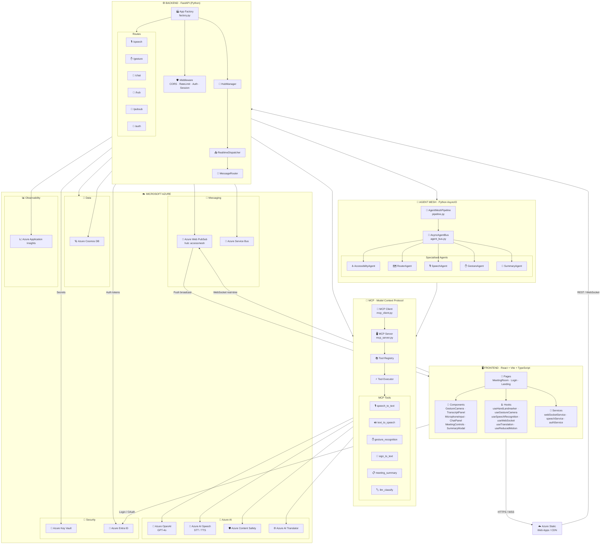

<div align="center">

# ♿ AccessMesh-AI

### *Every voice heard. Every gesture understood. Every meeting inclusive.*

[](https://python.org)
[](https://fastapi.tiangolo.com)
[](https://react.dev)
[](https://www.typescriptlang.org)
[](https://azure.microsoft.com)
[](LICENSE)

</div>

---

## 🎯 What is AccessMesh-AI?

**AccessMesh-AI** is an AI-driven accessible meeting platform that eliminates communication barriers between deaf, hard-of-hearing, and hearing participants — in real time. By combining real-time speech recognition, camera-based sign-language capture via MediaPipe, AI-powered gesture interpretation, and instant TTS synthesis, the system delivers a truly inclusive and omni-channel communication experience.

> **"Any communication modality — everyone in the same meeting."**

---

## ✨ Key Features

| Category | Feature |
|----------|---------|
| 🎤 **Voice → Text** | Real-time transcription via Azure AI Speech (STT) with multi-language support |
| 🤟 **Gesture → Text** | Camera-based sign capture and classification with MediaPipe Hand Landmarker |
| 🗣️ **Text → Audio** | TTS speech synthesis for accessible messages via Azure AI Speech |
| 🤟 **Sign Adaptation** | Converts spoken text to LIBRAS/ASL grammatical structure (gloss) via GPT-4o |
| 🧠 **Smart Routing** | Intent classification routes messages to the correct agent via GPT-4o |
| 📋 **Meeting Summary** | Automatic generation of structured summaries with key points via GPT-4o |
| 🛡️ **Content Moderation** | Message safety analysis via Azure Content Safety |
| 📡 **Real-Time Broadcast** | Instant message delivery to all participants via Azure Web PubSub |
| 🔐 **JWT Authentication** | Secure login with access token + refresh token (bcrypt + jose) |
| 📊 **Telemetry** | Full observability via Azure Application Insights + OpenTelemetry |
| 🗄️ **Persistence** | Sessions and messages stored in Azure Cosmos DB |
| ☁️ **Secure Secrets** | Credentials managed via Azure Key Vault (Managed Identity) |

---

## 🏗️ Architecture

### ☁️ Cloud Architecture — Azure Services Map

The diagram below shows the full system from the browser to Azure, including all layers: Frontend, Backend, Agent Mesh, MCP, and Azure-managed services.



#### Azure Services at a Glance

| Service | Role |
|---|---|
| 🤖 **Azure OpenAI (GPT-4o)** | LLM for routing, sign-language gloss, summarisation, classification |
| 🎤 **Azure AI Speech** | Real-time STT and natural TTS (multilingual) |
| 🛡️ **Azure Content Safety** | Automatic content moderation on all messages |
| 🪐 **Azure Cosmos DB** | NoSQL persistence — sessions, messages, meetings |
| 📡 **Azure Web PubSub** | Real-time WebSocket broadcast to all meeting participants |
| 🚌 **Azure Service Bus** | Async distributed messaging across Agent Mesh instances |
| 🔑 **Azure Key Vault** | Secure storage for all secrets and credentials (Managed Identity) |
| 👤 **Azure Entra ID** | OAuth 2.0 / JWT authentication |
| 📈 **Azure Application Insights** | Distributed traces, metrics and telemetry (OpenTelemetry) |

---

### 🤖 Agent Mesh — Internal Flow

AccessMesh-AI is built on the **Agent Mesh** pattern: a set of specialised, decoupled agents that communicate through an async pub/sub bus (`AsyncAgentBus`). Each agent subscribes to specific message types, processes them independently, and publishes results back onto the bus — with no direct coupling between agents.

```
┌─────────────────────────────────────────────────────────────────────────┐
│                         FRONTEND  (React 19 / Vite)                     │
│  MicrophoneInput  │  GestureCamera  │  TranscriptPanel  │  ChatPanel    │
└─────────────────────────┬───────────────────────────────────────────────┘
                          │  REST / WebSocket / WebPubSub
┌─────────────────────────▼───────────────────────────────────────────────┐
│                       BACKEND  (FastAPI)                                │
│  /hub  /auth  /speech  /gesture  /pubsub  /chat                         │
│  HubManager · RealtimeDispatcher · MessageRouter                        │
└─────────────────────────┬───────────────────────────────────────────────┘
                          │  AsyncAgentBus  (+ Azure Service Bus)
┌─────────────────────────▼─────────────────────────────────────────────── ┐
│                       AGENT MESH                                         │
│                                                                          │
│   AUDIO_CHUNK ──► SpeechAgent ──► TRANSCRIPTION                          │
│   GESTURE     ──► GestureAgent ──► TRANSCRIPTION                         │
│                                         │                                │
│                                    RouterAgent                           │
│                               (GPT-4o classification)                    │
│                                    ROUTED                                │
│                                       │                                  │
│                              AccessibilityAgent                          │
│                            (TTS synthesis + subtitles                    │
│                              + accessibility features)                   │
│                                  ACCESSIBLE                              │
│                                       │                                  │
│                                  SummaryAgent                            │
│                          (SUMMARY_REQUEST → Cosmos DB                    │
│                           → GPT-4o → SUMMARY broadcast)                  │
│                                    SUMMARY                               │
└─────────────────────────┬─────────────────────────────────────────────── ┘
                          │
┌─────────────────────────▼───────────────────────────────────────────────┐
│                  MCP SERVER  (Model Context Protocol)                   │
│  speech_to_text │ text_to_speech │ sign_to_text │ gesture_recognition   │
│  meeting_summary │ llm_classify                                         │
└─────────────────────────┬───────────────────────────────────────────────┘
                          │
┌─────────────────────────▼───────────────────────────────────────────────┐
│                      AZURE SERVICES                                     │
│  Speech │ OpenAI (GPT-4o) │ Cosmos DB │ Web PubSub │ Service Bus        │
│  Content Safety │ Key Vault │ App Insights │ Entra ID                   │
└─────────────────────────────────────────────────────────────────────────┘
```

### Message Flow

| Step | Message Type | Responsible Agent |
|------|-------------|------------------|
| 1 | `AUDIO_CHUNK` | `SpeechAgent` → transcribes via Azure AI Speech |
| 2 | `GESTURE` | `GestureAgent` → converts sign label to natural text |
| 3 | `TRANSCRIPTION` | `RouterAgent` → classifies intent via GPT-4o |
| 4 | `ROUTED` | `AccessibilityAgent` → TTS synthesis + subtitle enrichment |
| 5 | `ACCESSIBLE` | `SummaryAgent` (on `SUMMARY_REQUEST`) → GPT-4o summary → Cosmos DB + WebPubSub broadcast |

---

## 🔌 MCP — Model Context Protocol

The **MCP Server** is a capabilities layer exposed via FastAPI that fully decouples agents from Azure services. Agents call tools through `MCPClient` — they never import services directly. This guarantees replaceability, testability, and independent evolution of each capability.

```
Agents  ──►  MCPClient  ──►  HTTP POST /tools/call  ──►  MCP Server
                                                               │
                                                          ToolRegistry
                                                               │
                              ┌────────────────────────────────┤
                              ▼                                ▼
                     speech_to_text_tool            sign_to_text_tool
                     (Azure Speech SDK)             (GPT-4o gloss gen)
                              ▼                                ▼
                     text_to_speech_tool           llm_classify_tool
                     (Azure Speech TTS)            (GPT-4o routing)
                              ▼                                ▼
                   meeting_summary_tool       gesture_recognition_tool
                   (GPT-4o summarization)     (Azure OpenAI Vision)
```

### Registered MCP Tools

| Tool | Description |
|------|-------------|
| `speech_to_text_tool` | Transcribes base64 audio (WebM/Opus, WAV) — Azure Speech SDK |
| `text_to_speech_tool` | Multi-language speech synthesis — Azure Neural TTS |
| `sign_to_text_tool` | Adapts spoken text to LIBRAS/ASL grammatical structure (gloss) — GPT-4o |
| `gesture_recognition_tool` | Gesture classification from hand landmarks — Azure OpenAI Vision |
| `meeting_summary_tool` | Structured transcript summarisation — GPT-4o |
| `llm_classify_tool` | Intent classification for intelligent routing — GPT-4o |

MCP server endpoints:

```
GET  /health         → liveness probe
GET  /tools/list     → lists all tools with their input schemas
POST /tools/call     → invokes a tool by name
```

> Authentication via `X-MCP-API-Key` header (optional in dev mode).

---

## ⚛️ Frontend — React 19

A single-page application built with **React 19 + TypeScript + Vite 8**, focused on accessibility and inclusive UX.

### Pages

| Route | Page | Description |
|-------|------|-------------|
| `/login` | `LoginPage` | Email/password authentication |
| `/register` | `RegisterPage` | Sign-up with preferred communication mode |
| `/` | `Home` | Meeting room dashboard |
| `/meeting/:roomId` | `MeetingRoom` | Full accessible meeting room |

### Core Components

| Component | Role |
|-----------|------|
| `MicrophoneInput` | Audio capture and submission for transcription |
| `GestureCamera` | Camera with MediaPipe Hand Landmarker for sign capture |
| `TranscriptPanel` | Live transcript display panel |
| `ChatPanel` | Message panel with subtitle and accessibility mode support |
| `MeetingControls` | Meeting controls (mute, camera, end call) |
| `SummaryModal` | Displays the AI-generated summary at the end of a meeting |
| `ErrorBoundary` | React error boundary with accessible fallback UI |

### Key Dependencies

```json
{
  "@mediapipe/tasks-vision": "^0.10.14",  // Hand landmark detection
  "framer-motion": "^12.36.0",            // UI animations
  "react-router-dom": "^7.13.1",          // SPA routing
  "lucide-react": "^0.577.0"              // Accessible icons
}
```

---

## 🐍 Backend — Python / FastAPI

REST and WebSocket API built with **FastAPI** and **Uvicorn**, with lifecycle managed by `asynccontextmanager`.

### Route Structure

| Prefix | File | Purpose |
|--------|------|---------|
| `/auth` | `auth_routes.py` | Registration, login, token refresh, user preferences |
| `/hub` | `hub_routes.py` | Unified omni-channel endpoint (speech/gesture/text) |
| `/speech` | `speech_routes.py` | Audio upload and transcription response |
| `/gesture` | `gesture_routes.py` | Frame/landmark gesture classification |
| `/pubsub` | `pubsub_routes.py` | Azure Web PubSub integration |
| `/chat` | `chat_routes.py` | Chat messages and session history |

### Integrated Azure Services

| Service | Class | Environment Variable |
|---------|-------|---------------------|
| Azure Speech | `SpeechService` | `AZURE_SPEECH_KEY`, `AZURE_SPEECH_REGION` |
| Azure OpenAI | `OpenAIService` | `OPENAI_KEY`, `OPENAI_ENDPOINT`, `OPENAI_DEPLOYMENT` |
| Azure Cosmos DB | `CosmosService` | `COSMOS_ENDPOINT`, `COSMOS_KEY` |
| Azure Web PubSub | `WebPubSubService` | `WEBPUBSUB_CONNECTION_STRING` |
| Azure Service Bus | `ServiceBusService` | `SERVICEBUS_CONNECTION_STRING` |
| Azure Content Safety | `ContentSafetyService` | `CONTENT_SAFETY_ENDPOINT`, `CONTENT_SAFETY_KEY` |
| Azure Key Vault | `KeyVaultService` | `AZURE_KEYVAULT_URL` |
| Azure App Insights | `TelemetryService` | `APPINSIGHTS_CONNECTION_STRING` |
| Azure Gesture (OpenAI) | `GestureService` | `GESTURE_API_KEY`, `GESTURE_API_ENDPOINT` |
| Summarization | `SummarizationService` | `OPENAI_KEY`, `OPENAI_ENDPOINT` |

> All services operate in **graceful degraded mode**: when credentials are not configured, the system continues running with an in-memory fallback or stub — startup never fails due to missing optional services.

### Security

- Passwords hashed with **bcrypt** via `passlib`
- **JWT** tokens (access + refresh) via `python-jose`
- Per-IP rate limiting via **SlowAPI**
- Input validation via **Pydantic v2**
- Production secrets loaded from **Azure Key Vault** (Managed Identity)

---

## 🛠️ Technology Stack

### Backend
| Technology | Version | Usage |
|-----------|---------|-------|
| Python | 3.11+ | Main runtime |
| FastAPI | 0.110+ | REST API and WebSocket |
| Uvicorn | 0.29+ | ASGI server |
| Pydantic v2 | 2.6+ | Validation and schemas |
| azure-cognitiveservices-speech | 1.37+ | STT / TTS |
| azure-cosmos | 4.7+ | Session persistence |
| azure-messaging-webpubsubservice | 1.1+ | Real-time broadcast |
| azure-servicebus | 7.12+ | Async distributed messaging |
| azure-ai-contentsafety | 1.0+ | Content moderation |
| azure-monitor-opentelemetry | 1.6+ | Telemetry and traces |
| python-jose | 3.3+ | JWT |
| passlib[bcrypt] | 1.7+ | Password hashing |
| httpx | 0.27+ | Async HTTP client |

### Frontend
| Technology | Version | Usage |
|-----------|---------|-------|
| React | 19 | UI framework |
| TypeScript | 5.9 | Static typing |
| Vite | 8 | Build tool and dev server |
| @mediapipe/tasks-vision | 0.10.14 | Hand landmark detection |
| Framer Motion | 12 | UI animations |
| React Router DOM | 7 | SPA routing |
| Lucide React | 0.577+ | Accessible icons |

### Cloud & Infrastructure
| Azure Service | Usage |
|--------------|-------|
| **Azure OpenAI (GPT-4o)** | Intelligent routing, sign-language gloss generation, meeting summary, gesture classification |
| **Azure Speech Service** | Multilingual STT + natural TTS |
| **Azure Web PubSub** | Real-time broadcast channel for all participants |
| **Azure Service Bus** | Distributed message queue across agent mesh instances |
| **Azure Cosmos DB** | Session, message and summary persistence |
| **Azure Content Safety** | Automatic content moderation |
| **Azure Key Vault** | Secure secrets and credentials management |
| **Azure Application Insights** | Observability, distributed traces and metrics |
| **Azure Identity** | Managed Identity for zero-secret authentication in production |

---

## 📦 Installation

### Prerequisites

- Python 3.11+
- Node.js 20+
- An Azure account with the services listed above provisioned

### 1. Clone the repository

```bash
git clone https://github.com/your-username/AccessMesh-AI.git
cd AccessMesh-AI
```

### 2. Set up the Python environment

```bash
# Create and activate the virtual environment
python -m venv .venv

# Windows
.venv\Scripts\activate

# Linux / macOS
source .venv/bin/activate

# Install dependencies
pip install -r requirements.txt
```

### 3. Configure environment variables

Copy the example file and fill in your Azure credentials:

```bash
cp .env.example .env
```

Edit `.env` with the appropriate values:

```env
# Azure OpenAI
AZURE_OPENAI_KEY=your-openai-key
AZURE_OPENAI_ENDPOINT=https://your-resource.openai.azure.com/
AZURE_OPENAI_DEPLOYMENT=gpt-4o

# Azure Speech
AZURE_SPEECH_KEY=your-speech-key
AZURE_SPEECH_REGION=eastus

# Azure Web PubSub
WEBPUBSUB_CONNECTION_STRING=Endpoint=https://...

# Azure Service Bus
SERVICEBUS_CONNECTION_STRING=Endpoint=sb://...

# Azure Cosmos DB
COSMOS_ENDPOINT=https://your-cosmos.documents.azure.com:443/
COSMOS_KEY=your-cosmos-key

# Azure Content Safety
CONTENT_SAFETY_ENDPOINT=https://your-content-safety.cognitiveservices.azure.com/
CONTENT_SAFETY_KEY=your-content-safety-key

# Azure AI Translator
TRANSLATOR_KEY=your-translator-key

# Azure Key Vault (production)
AZURE_KEYVAULT_URL=https://your-keyvault.vault.azure.net/

# Azure Application Insights
APPINSIGHTS_CONNECTION_STRING=InstrumentationKey=...

# JWT
SECRET_KEY=your-very-secret-key-change-in-production
```

### 4. Start the Backend

```bash
# From the project root
uvicorn backend.main:app --host 0.0.0.0 --port 8000 --reload
```

The backend will be available at `http://localhost:8000`.  
Interactive API docs (Swagger UI): `http://localhost:8000/docs`

### 5. Start the Frontend

```bash
cd frontend

# Install dependencies
npm install

# Start the development server
npm run dev
```

The frontend will be available at `http://localhost:5173`.

### 6. (Optional) Start the MCP Server standalone

```bash
# Only needed if running the MCP Server as a separate process
uvicorn mcp.mcp_server:mcp_app --host 0.0.0.0 --port 8001 --reload
```

### Production Build (Frontend)

```bash
cd frontend
npm run build
# Artifacts will be in frontend/dist/
```

---

## 🗂️ Project Structure

```
AccessMesh-AI/
├── agents/                  # Agent Mesh — specialised agents
│   ├── agent_bus.py         # AsyncAgentBus (pub/sub backbone)
│   ├── pipeline.py          # AgentMeshPipeline (orchestrator)
│   ├── router_agent.py         # Intelligent routing (GPT-4o)
│   ├── accessibility_agent.py  # TTS synthesis + subtitles + accessibility features
│   ├── speech_agent.py         # STT via Azure AI Speech
│   ├── gesture_agent.py        # Gesture label → natural text
│   └── summary_agent.py        # Meeting summary via GPT-4o
│
├── mcp/                     # Model Context Protocol
│   ├── mcp_server.py        # FastAPI MCP Server
│   ├── mcp_client.py        # HTTP client for tool calls
│   ├── tool_registry.py     # Central tool registry
│   ├── tool_executor.py     # Tool executor
│   └── tools/               # Tool implementations
│
├── backend/                 # FastAPI Application
│   ├── main.py              # Entry point (Uvicorn)
│   └── app/
│       ├── factory.py       # App factory (lifespan / DI)
│       ├── auth.py          # JWT + bcrypt
│       ├── config.py        # Centralised configuration
│       ├── core/            # HubManager + RealtimeDispatcher
│       ├── routes/          # HTTP routes
│       └── models/          # Pydantic models
│
├── services/                # Azure SDK wrappers
├── shared/                  # Shared schemas and config
│   ├── config.py            # Settings (Key Vault + env)
│   └── message_schema.py    # Message enums and models
│
└── frontend/                # React 19 SPA
    └── src/
        ├── components/      # UI components
        ├── pages/           # Application pages
        ├── services/        # HTTP/WebSocket clients
        ├── context/         # Auth + Meeting providers
        ├── hooks/           # Custom hooks
        └── utils/           # Utilities (gesture classifier, etc.)
```
</div>
